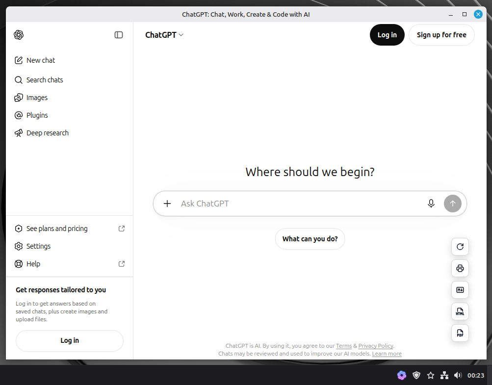

# Extended ChatGPT Desktop Client Wrapper (ChatGPT-EX)

A native Electron desktop wrapper that opens ChatGPT in an app window.

This project is a fork of the unofficial [ChatGPT-client](https://github.com/jfscoertzen/ChatGPT-client) application.

## Features

- Bottom-right refresh button for reloading ChatGPT from inside the app window.
- Bottom-right Markdown export button for saving the currently rendered chat as `chatgpt-export-YYYY-MM-DDTHH-MM-SS.md`.
- Bottom-right HTML export button for saving the currently rendered chat as a self-contained `chatgpt-export-YYYY-MM-DDTHH-MM-SS.html` file.
- Bottom-right PDF export button for saving the currently rendered chat as `chatgpt-export-YYYY-MM-DDTHH-MM-SS.pdf`.
- Bottom-right print button for printing the currently rendered chat.
- Exports and print jobs use the Electron window title for the active chat instead of the project-level page title.
- The window title bar displays `<chat subject> - ChatGPT-EX`; exports and print omit the application-name suffix.
- Drag-and-drop file upload fallback for adding images/files to the chat prompt.
- Export preferences for default folder, timestamps, role headings, PDF page size, and saving without a dialog.
- F5 reload and F12 Developer Tools shortcuts.
- Right-click context menu with cut, copy, paste, and select-all actions.
- System tray icon while running; closing the window hides it to the tray when Close to Tray is enabled.
- Only one app instance can run; launching it again restores the existing window.
- Tray menu with show, close-to-tray, and quit actions.
- Native menu bar with File, Settings, View, and Help menus. Export and print actions are available from the File menu and the bottom-right action overlay.
- Clear cookies, cache, and site storage from `File > Clear Browsing Data`.
- File menu navigation controls for Back (`Alt+Left`) and Forward (`Alt+Right`).
- `Developer Tools (F12)` in the View menu toggles detached Chromium DevTools.
- Settings menu for close-to-tray, start minimized, always-on-top behavior, Compatibility Mode, Voice/Microphone Access, window-state persistence, and export preferences.
- ChatGPT links that request a new tab, including Branch in a new chat, stay in the app; external destinations open in the default browser.
- In-window navigation is limited to ChatGPT, OpenAI authentication, and official Google, Microsoft, and Apple sign-in pages; other destinations open in the default browser.
- Spell checking is disabled in the app window.

## Screenshot


## Export Preferences

Export preferences are available from the application menu bar under `Settings > Export Preferences`.

- Choose a default export folder, or reset exports back to Documents.
- Include or hide export timestamps.
- Include or hide User/Assistant role headings.
- Choose the PDF page size: A4 or Letter.
- Enable saving without a dialog to write exports directly to the default folder.

Exports include the currently rendered conversation. Older messages that ChatGPT has not loaded into the page may be omitted. Markdown, HTML, PDF, and print preserve code blocks and their line breaks.

## Export Selected Messages

Choose `File > Select Messages...` to display compact checkboxes above the rendered chat bubbles. Each selector occupies its own row and scrolls with its message without covering the text.

- Selecting a user message also selects its following assistant reply. Either message can be deselected individually for answer-only or prompt-only exports.
- Use **Select All** or **Clear** to adjust the selection quickly.
- **Done** hides the checkboxes while keeping the selection active; **Edit Selection** displays them again.
- Markdown, HTML, PDF, and Print use only selected messages, in conversation order. Select at least one message before exporting.
- **Cancel** exits selection mode and restores full-conversation exports. Switching chats also clears selection.

Selection is temporary and covers currently rendered messages; it does not load older conversation history. Exports capture the selected content as it exists when the export action is used.

## Compatibility Mode

Compatibility Mode is available from the application menu bar under `Settings > Compatibility Mode`.

When enabled, ChatGPT-EX reloads ChatGPT with a Chrome-like user agent instead of Electron's default user agent. This can help with site compatibility, but it may not avoid ChatGPT login requirements because those are controlled by ChatGPT and can also depend on cookies, region, account state, experiments, or other browser signals.

The Chrome version in this user agent is taken from Electron's embedded Chromium version automatically.

## Voice/Microphone Access

Voice/Microphone Access is available from the application menu bar under `Settings > Voice/Microphone Access`.

Microphone access is off by default. When disabled, ChatGPT-EX answers ChatGPT recording permission checks immediately instead of leaving microphone-related browser APIs unresolved. Speaker/audio-output access for ChatGPT is allowed so voice previews can play in settings. Enable Voice/Microphone Access only if you want to use ChatGPT recording features.

## Window State

`Settings > Remember Window Size and Position` is off by default. When enabled, ChatGPT-EX saves the normal window size and display position, then restores them at the next launch. Stored bounds outside connected displays are ignored.

## Prerequisites (Ubuntu)

```bash
sudo apt update
sudo apt install -y libnss3 libatk-bridge2.0-0 libgtk-3-0 libxss1 libasound2
```

## Install

Electron 43 requires Node.js 22.12.0 or newer.

```bash
npm install
```

## Upgrade to Electron 43

```bash
npm install --save-dev --save-exact electron@43.7.9
```

## Run the app

```bash
npm start
```

## Verify export extraction

Run the Electron-based regression fixtures for Markdown, HTML, PDF, and print extraction:

```bash
npm run test:export
```

The fixtures check supported ChatGPT message layouts, switching chats without reloading, message roles, and code-block formatting.

## Build Linux packages

```bash
npm run build:linux
```

Build outputs are generated in `dist/`:
- `.AppImage`
- `.deb`

## Build Windows packages

Run this on Windows:

```bash
npm run build:win
```

Build outputs are generated in `dist/`:
- NSIS installer: `ChatGPT-EX Setup <version>.exe`
- Portable executable: `ChatGPT-EX <version>.exe`
- Unpacked app: `win-unpacked/ChatGPT-EX.exe`

Windows builds use `build/icons/icon.ico` for the installer, portable executable, and unpacked `ChatGPT-EX.exe` icon.

## Icon Attribution

Some UI icons are from [Tabler Icons](https://tabler.io/icons), licensed under the MIT License. See [`build/icons/LICENSE-ICONS`](build/icons/LICENSE-ICONS).
